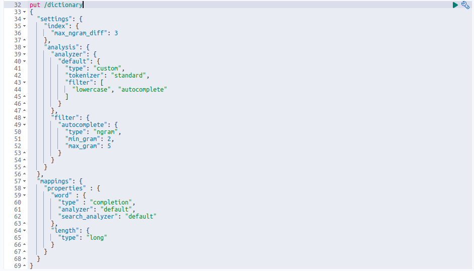

# ElasticAutocomplete

To start application run the simple command:

```bash
docker-compose up -d
```

It will run the applications:

  * [API Server](http://localhost:4002/) on port `4002`
  * [Kibana](http://localhost:5601/) on port `5601`
  * ElasticSearch(not accessible from outside).

After you see that in a console, you can start using API:


# API Usage

Replace a `word` variable with a real word that you want to find and a `limit` variable to determine the number of words returned to you.

* Open link in a browser [http://localhost:4002/api/dictionary?word=ukr&limit=50](http://localhost:4002/api/dictionary?word=ukr&limit=50)
 * Make a curl request 
    ```bash
    curl --location --request GET 'http://localhost:4002/api/dictionary?word=ukr&limit=50' \
    --header 'Content-Type: application/json' \
    --data-raw '{
        "phone": "380968104516"
    }'
    ```

# Examples

* Searching for a word "ukraine" with a input of "urk".
  
* Searching for a word "hello" with a input of "hell".
  
* Searching for a word "ukraine" with a input of "ukraine".
  
* Searching for a word "ukraine" with a input of "ukraige".
  
* Searching for a word "ukraine" with a input of "ikraige".
  

# Settings

* I've created an index `dictionary` with a `standart` tokenizer and a `lowercase` and `ngram 2-5` filters for a field `word`. And just `long` type for a field `length`.
    
* Next i filled this index with an `eng dictionary words` on application startup(takes some time to index it).
    
* Then i've created a quey for searching words with autocomplision and misspelling with a `"minimum_should_match": "2<-1 4<-2 7<-3"` that perfectly fits all of my misspelling options.
    